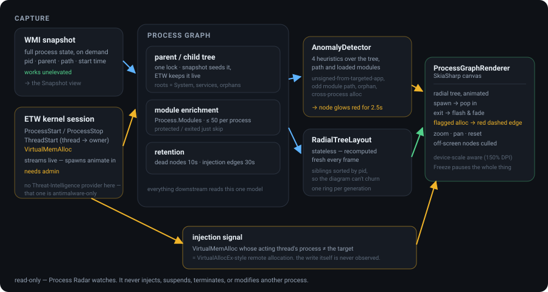
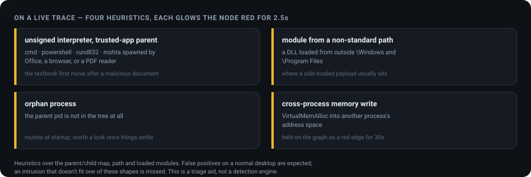

<div align="center">

# Process Radar

**See what every process on this machine is doing — as it happens.**

A live radial graph of the Windows process tree: parent/child spawn lines, loaded-module
enrichment, and anomaly heuristics that glow a node the moment they fire. Built on ETW and
WMI, drawn with SkiaSharp in a WPF app. It watches; it never touches anything.

[](#requirements)
[](https://dotnet.microsoft.com)
[](https://github.com/jakoreilly/ProcessRadar/actions/workflows/build.yml)
[](LICENSE)



</div>

---

## What it is — and what it isn't

Process Radar is a **read-only observability tool**. It watches; it never injects, suspends,
terminates, or modifies another process. Elevation is required only to open an ETW kernel
session — nothing else in the app needs it.

It is **not** an antivirus, an EDR, or a detection product, and should not be relied on as one:

- The "injection" signal is a single narrow heuristic — a `VirtualMemAlloc` whose acting thread
  belongs to a different process than the allocation's target. That's the classic
  `VirtualAllocEx` precursor to injection, but the write itself is never observed. Real
  OpenProcess/WriteProcessMemory events live in the restricted
  `Microsoft-Windows-Threat-Intelligence` provider, which is reserved for protected-process
  antimalware and is not subscribable from a normal process even when elevated. See the doc
  comment in
  [`Capture/ProcessEnumerationService.cs`](ProcessRadar/Capture/ProcessEnumerationService.cs)
  for the full reasoning.
- The anomaly rules are heuristics over the parent/child map, executable path, and loaded
  modules. They will produce false positives on a normal desktop and will miss anything that
  doesn't fit their shape.

Treat it as a way to *see* process behaviour that would otherwise mean reading a log — a triage,
teaching, and debugging aid, not a security control.

## Why you'd want it

- **Read a spawn tree at a glance.** "What launched this?" is a picture, not a `wmic` invocation
  and a squint.
- **Watch living-off-the-land patterns in the shape they actually take** — a shell coming off an
  Office process, a DLL from the wrong directory — instead of learning the pattern from a slide.
- **Debug a module-load or orphaned-process problem** while it is happening, with the offending
  node lit up.
- **Catch a burst.** Freeze-frame holds a storm of short-lived processes still long enough to
  read, then catches you up.

---

## Requirements

- **Windows** 10 or 11
- **.NET 10 SDK** — `dotnet --version` should report `10.x`
- **Administrator rights only for the live ETW trace.** The one-shot **Snapshot** view works
  fine unelevated.

## Install

Double-click **`run.cmd`** — it requests elevation (UAC prompt), builds, and launches the app.

Or, manually:

```
dotnet run --project ProcessRadar\ProcessRadar.csproj -c Release
```

Run from an **elevated** terminal for live tracing and injection detection; without admin, only
**Snapshot** works.

## Using the app

1. **Snapshot** — one-shot WMI process list, builds the graph as it stands right now. Works
   without admin.
2. **Start live trace (admin)** — subscribes to ETW process/thread events for continuous updates:
   new spawns animate in with a "pop", exits flash-and-fade. Requires elevation.
3. The graph is a **radial tree** from the root (System/services). Red animated-dash edges mark a
   flagged cross-process memory allocation, retained for 30s.
4. **Anomalies panel** (bottom right) logs the four heuristics below; the matching node glows red
   for 2.5s.
5. **Filter box** — live-filters both the process list and the graph by name.
6. **Click any node** for the inspector overlay: path, loaded-module count, first/last seen,
   anomaly state, SHA-256, signer, command line.
7. **Freeze frame** pauses rendering so you can inspect a burst of activity without new
   spawns/exits animating it away. Unfreezing catches you up to whatever happened underneath.
8. **Zoom / pan** — mouse wheel to zoom, drag to pan, double-click to reset.
9. **Export logs** — saves the full process table (independent of the filter box) and the whole
   session's anomaly history to one CSV file, off the UI thread so a long trace doesn't stall the
   window.

## The anomaly heuristics



Each is evaluated when a process is first seen via a *live* transition, not on the bulk snapshot,
and each is deliberately loose. On a busy machine the panel will fill — that is the heuristics
working as designed, not a bug. Narrow the graph with the filter box.

---

## How it works

Six stages, each with one job. The doc comment on each class carries the reasoning.

- **Capture** (`Capture/ProcessEnumerationService.cs`) — a **WMI snapshot** gives full state on
  demand and needs no elevation; a **kernel ETW session** streams `ProcessStart`/`ProcessStop`
  and `ThreadStart` as they happen, and needs admin. Both feed one model.
- **The graph** (`Graph/ProcessGraph.cs`) — a locked parent/child tree. The snapshot seeds it;
  ETW keeps it live. Module enrichment goes through the managed `Process.Modules` API (no
  P/Invoke), capped at 50 per process; a protected or exited process just fails enrichment and is
  skipped. Dead nodes linger 10s, injection edges 30s.
- **Layout** (`Graph/RadialTreeLayout.cs`) — a stateless radial tree, recomputed every frame.
  Siblings are sorted by pid — the one property of a node that never changes — so the diagram
  lays out identically frame to frame instead of churning as the dictionary reorders.
- **Render** (`Render/ProcessGraphRenderer.cs`) — SkiaSharp. Spawns scale in, exits fade out,
  everything draws through a zoom/pan transform and a device scale (so 150% DPI doesn't shrink
  the diagram into a corner), and off-screen nodes and edges are culled.
- **Anomalies** (`Analysis/AnomalyDetector.cs`) — the four heuristics above, over data the graph
  already has. Two further signals from the original plan (hollowing detection, full re-parent
  tracking) need deeper introspection and are deferred rather than faked.
- **Injection highlighting** — the ETW session tracks thread → owning-process from `ThreadStart`,
  so a `VirtualMemAlloc` whose acting thread's process differs from the target address space is
  raised as a remote allocation. The write is never directly observed; see the scope note above.

## Diagnostics and privacy

The **Debug** toggle turns on an on-canvas performance HUD and writes a per-run log to:

```
%LOCALAPPDATA%\ProcessRadar\logs\processradar-<timestamp>.log
```

**It is off by default, deliberately.** That log records executable paths and loaded-module
paths from the machine it ran on, which routinely embed the operator's username and directory
layout. Nothing is ever transmitted anywhere — the app makes no network connections — but review
a log before attaching it to a bug report or sharing it.

The click-to-inspect panel also surfaces command lines (via WMI), which can contain credentials
passed as arguments by other software. That data stays on screen and is never written to the log
or an export.

**Export logs** writes the same kind of data — executable paths, process names, anomaly
descriptions — to a CSV file you choose. Nothing is transmitted anywhere; review the file before
sharing it, same as the debug log. Text fields a spreadsheet would treat as a formula are escaped
on the way out, since process names and paths are chosen by whatever is being observed.

## Troubleshooting

- **Live trace button does nothing** — the process isn't elevated. Re-run via `run.cmd` or from
  an admin terminal.
- **No injection signals ever fire** — expected in normal use. See the scope note above; this is
  a narrow heuristic, not a detection engine.
- **Anomalies panel floods on a busy machine** — the heuristics are intentionally loose. Use the
  filter box to narrow the graph.

---

## Development

```
dotnet build ProcessRadar.slnx -c Release
```

There is no automated test suite; CI builds the solution on `windows-latest` on every push and
PR. WPF and the ETW/WMI capture paths are Windows-only, so the build is not matrixed.

```
ProcessRadar/Capture/     WMI snapshot + ETW kernel session
ProcessRadar/Graph/       parent/child model, radial layout
ProcessRadar/Analysis/    anomaly heuristics, process inspector
ProcessRadar/Render/      SkiaSharp renderer, zoom/pan transform
ProcessRadar/Models/      process, node, injection-signal records
ProcessRadar/Diagnostics/ debug HUD, frame stats, CSV export
```

## License

Apache License 2.0 — see [LICENSE](LICENSE) and [NOTICE](NOTICE). Bundles
`Microsoft.Diagnostics.Tracing.TraceEvent`, `SkiaSharp.Views.WPF`, and `System.Management`, each
MIT.

---

<div align="center">
<sub>A radar sweeps a volume and paints back whatever is moving in it. This one sweeps the process table and the ETW stream, and paints the spawn tree.</sub>
</div>
